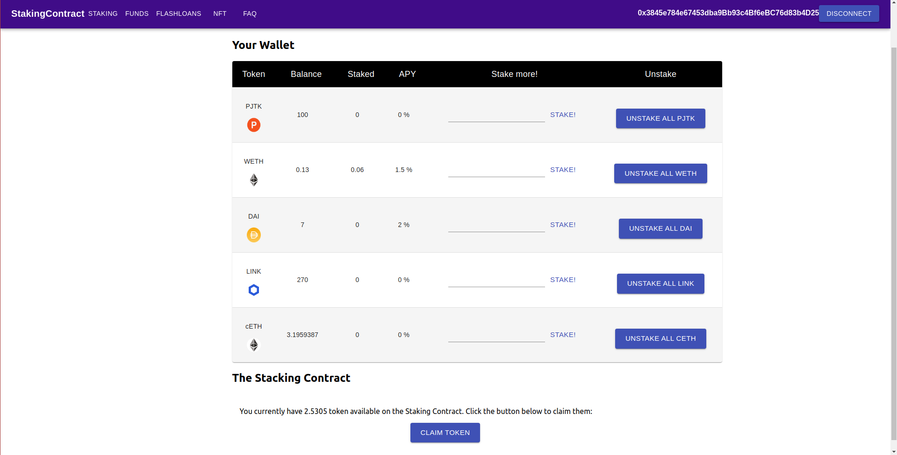

# DeFi Project

Staking Dapp with front-end that allows users to stake various ERC20 tokens and earn a yield in a custom token `ProjectToken`. The contract interact with Aave and Compound to deposit the token received from the users and earn a yield.

- ERC20 Token: `ProjectToken.sol`
- Staking contract: `StakingContract.sol`, current version on kovan: 0x31d314c0eC0A3d78Ce559D575DB2072334d5F354
- Interface to interact with lending protocol: `ILendingProtocol`
- Implementation of that interface for Aave and Compound.
- Unit tests for every functions
- Integrations test on Kovan testnet

## TODO

- [ ] Remove contracts not related to StakingContract: flashloan stuff, uniswap, ...
- [ ] get second account and differentiate between deployer and user in integratioins tests
- [ ] rewrite integration test for new implementation
- [ ] add nicer interface for front-end: graphs with token staked, yield earned, ...

### Token
- [x] Token: deployment script
- [x] Token: tests
- [x] better way of issuing token to stakers

### Staking Contract
- [x] deploy script
- [x] test
- [x] add Aave deposit/withdraw
- [x] test       "
- [x] proxy to deposit on aave or compound, contract that take care of sending token x to one protocol and x to another

### Lending Protocol interaction

- [x] Add Aave interaction
- [x] Aave: deployment script
- [x] Aave: tests
- [x] Add Compound interaction
- [x] C: deployment script
- [x] C: tests
- [x] Lending protocol Interface
- [x] Adapt contract to use several lending protocol
- [x] security/error handling

### Others
- [ ] DAO

